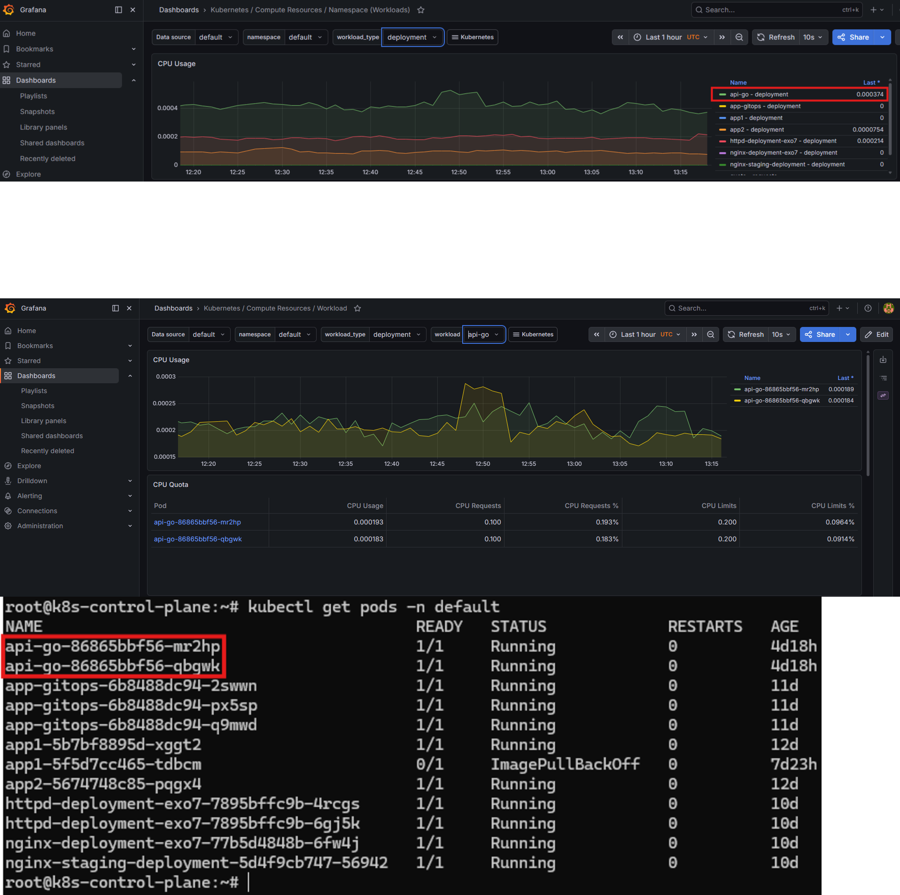
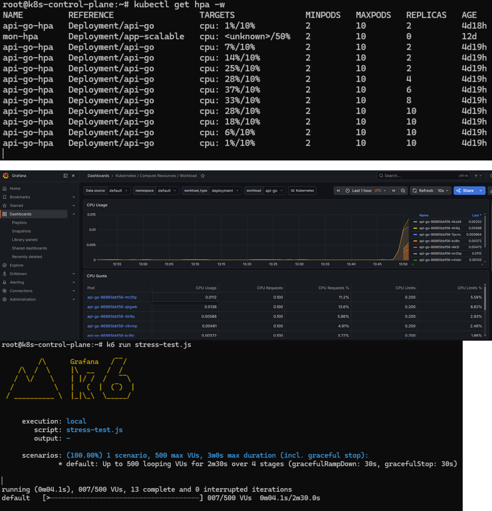
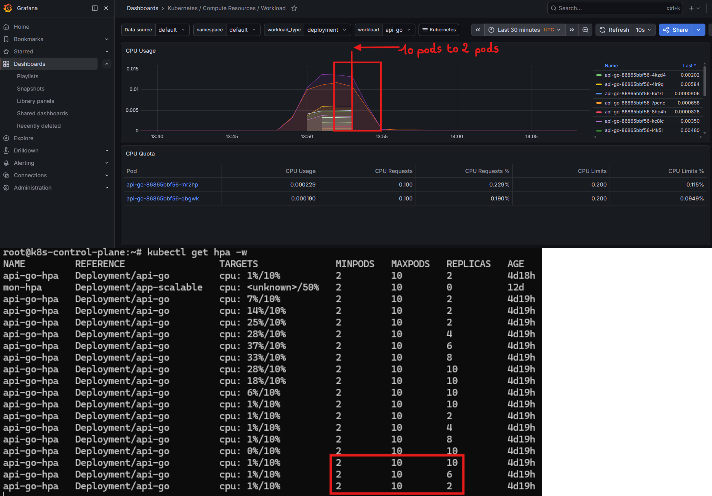

# k8s-api-go

A production-grade REST API written in Go, deployed on a self-hosted Kubernetes cluster with full observability, autoscaling, and GitOps-based continuous delivery.

---

## Overview

This project demonstrates the deployment of a containerized Go application on a bare-metal Kubernetes cluster provisioned with kubeadm. It covers the full lifecycle from infrastructure setup to automated deployment, horizontal autoscaling, and real-time monitoring.

---

## Architecture

```
Internet
    |
    | HTTP
    v
MetalLB (IP: 62.238.27.152)
    |
    v
NGINX Ingress Controller
    |
    | /api/*  ->  rewrite  ->  /*
    v
Service ClusterIP (api-go-service)
    |
    v
Deployment: api-go (HPA: 2 - 10 replicas)
    |
    v
Pods: Go API (port 8080)
```

---

## Stack

| Layer | Technology |
|---|---|
| Cloud / VPS | Hetzner CX23 (3 nodes) |
| Cluster provisioning | kubeadm |
| Container runtime | containerd |
| CNI (networking) | Flannel |
| Load balancer (on-prem) | MetalLB |
| Ingress controller | NGINX Ingress Controller |
| Application | Go (net/http) |
| Containerization | Docker |
| Container registry | Docker Hub |
| Autoscaling | Horizontal Pod Autoscaler (HPA) |
| Metrics collection | metrics-server, Prometheus, kube-state-metrics, Node Exporter |
| Dashboards | Grafana |
| GitOps / CD | ArgoCD |
| Load testing | k6 |

---

## Infrastructure

The cluster runs on 3 VPS instances hosted at Hetzner, connected via a private network:

```
k8s-control-plane   (IP privee: 10.0.0.3)   -> control-plane
k8s-worker-1        (IP privee: 10.0.0.X)   -> worker
k8s-worker-2        (IP privee: 10.0.0.X)   -> worker
```

### Cluster provisioning

```bash
# Initialisation du control-plane
kubeadm init \
  --apiserver-advertise-address=10.0.0.3 \
  --pod-network-cidr=10.244.0.0/16 \
  --node-name=k8s-control-plane

# Installation du CNI
kubectl apply -f https://raw.githubusercontent.com/flannel-io/flannel/master/Documentation/kube-flannel.yml

# Jonction des workers
kubeadm join 10.0.0.3:6443 --token <token> --discovery-token-ca-cert-hash sha256:<hash>
```

### MetalLB

MetalLB simulates a cloud load balancer on bare-metal infrastructure. It assigns a public IP to any Service of type `LoadBalancer`, making it accessible from the internet.

```bash
kubectl apply -f https://raw.githubusercontent.com/metallb/metallb/v0.14.9/config/manifests/metallb-native.yaml
```

```yaml
apiVersion: metallb.io/v1beta1
kind: IPAddressPool
metadata:
  name: hetzner-pool
  namespace: metallb-system
spec:
  addresses:
  - 62.238.27.152/32
```

---

## Application

The API exposes three endpoints:

| Method | Route | Description |
|---|---|---|
| GET | /health | Health check |
| GET | /items | List all items |
| POST | /items | Create an item |

### Example

```bash
# Health check
curl http://62.238.27.152/api/health
# {"status":"ok"}

# Create an item
curl -X POST http://62.238.27.152/api/items \
  -H "Content-Type: application/json" \
  -d '{"name": "example"}'
# {"id":1,"name":"example"}

# List items
curl http://62.238.27.152/api/items
# [{"id":1,"name":"example"}]
```

---

## Kubernetes Resources

### Deployment

```yaml
resources:
  requests:
    cpu: 100m
    memory: 64Mi
  limits:
    cpu: 200m
    memory: 128Mi
```

Liveness and readiness probes are configured on `GET /health` to ensure Kubernetes only routes traffic to healthy pods.

### Horizontal Pod Autoscaler

```yaml
minReplicas: 2
maxReplicas: 10
averageUtilization: 10  # scale-up threshold (% of CPU requests)
```

### Ingress

URL rewriting is handled by the NGINX Ingress Controller. Requests to `/api/*` are rewritten to `/*` before being forwarded to the service, keeping the application routes clean.

```yaml
annotations:
  nginx.ingress.kubernetes.io/rewrite-target: /$2
path: /api(/|$)(.*)
pathType: ImplementationSpecific
```

---

## GitOps with ArgoCD

All Kubernetes manifests are stored in this repository under `k8s/`. ArgoCD continuously watches the repository and automatically synchronizes the cluster state with what is declared in Git.

```
Git push
    |
    v
ArgoCD detects change (OutOfSync)
    |
    v
ArgoCD applies manifests to the cluster
    |
    v
Cluster state matches Git (Synced)
```

Configuration:

- Sync policy: Automated
- Self Heal: enabled (restores any manual change made directly on the cluster)
- Prune: enabled (removes resources deleted from Git)

---

## Monitoring

The full observability stack is deployed via the `kube-prometheus-stack` Helm chart:

```bash
helm install prometheus prometheus-community/kube-prometheus-stack \
  --namespace monitoring \
  --create-namespace
```

This installs:

- **Prometheus** - scrapes metrics from all cluster components every 15 seconds
- **Grafana** - visualizes metrics through pre-built dashboards
- **AlertManager** - handles alerting rules
- **Node Exporter** - collects hardware metrics from each node (CPU, RAM, disk)
- **kube-state-metrics** - exposes Kubernetes object state (pod count, replica count, etc.)

---

## Load Test and Autoscaling Results

### Test configuration (k6)

```javascript
export let options = {
  stages: [
    { duration: '30s', target: 10  },
    { duration: '1m',  target: 50  },
    { duration: '30s', target: 100 },
    { duration: '30s', target: 0   },
  ],
};
```

### Before the test

2 pods running, CPU usage well below the scale-up threshold:

```
NAME                              READY   STATUS    RESTARTS
api-go-86865bbf56-mr2hp           1/1     Running   0
api-go-86865bbf56-qbgwk           1/1     Running   0
```

```
api-go-hpa   Deployment/api-go   cpu: 1%/10%   REPLICAS: 2
```

CPU usage per pod (Grafana):

```
api-go-86865bbf56-mr2hp   0.193% of requests
api-go-86865bbf56-qbgwk   0.183% of requests
```



### During the test

As virtual users ramp up, CPU utilization exceeds the 10% threshold and the HPA triggers a scale-up:

```
cpu: 7%/10%    REPLICAS: 2
cpu: 14%/10%   REPLICAS: 2
cpu: 25%/10%   REPLICAS: 4   <- scale-up triggered
cpu: 28%/10%   REPLICAS: 6
cpu: 37%/10%   REPLICAS: 8
cpu: 33%/10%   REPLICAS: 10  <- peak
```

CPU usage during the test (Grafana):

```
api-go-86865bbf56-mr2hp   11.2% of requests
api-go-86865bbf56-qbgwk   13.6% of requests
api-go-86865bbf56-4lr9q    5.86% of requests
```



### After the test

Once load drops, the HPA scales back down to the minimum replica count:

```
cpu: 6%/10%    REPLICAS: 10
cpu: 1%/10%    REPLICAS: 8
cpu: 0%/10%    REPLICAS: 2   <- scale-down complete
```



### Summary

| Metric | Value |
|---|---|
| Initial replicas | 2 |
| Peak replicas | 10 |
| Scale-up trigger | CPU > 10% of requests |
| Scale-down delay | ~5 minutes (default stabilization window) |
| Max CPU per pod during test | ~13.7% of requests |

---

## Repository Structure

```
k8s-api-go/
├── main.go               <- Go application source
├── go.mod
├── Dockerfile
├── stress-test.js        <- k6 load test script
├── k8s/
│   ├── deployment.yaml
│   ├── service.yaml
│   ├── ingress.yaml
│   └── hpa.yaml
└── screenshots/
    ├── grafana-before.png
    ├── grafana-during.png
    └── grafana-after.png
```

---

## How to Add Screenshots

1. Create a `screenshots/` folder at the root of the repository
2. Name your files exactly as referenced above:
   - `grafana-before.png` - Grafana dashboard showing 2 pods, CPU near 0%
   - `grafana-during.png` - Grafana dashboard showing CPU spike and multiple pods
   - `grafana-after.png` - Grafana dashboard showing CPU back to baseline, 2 pods
3. Commit and push - ArgoCD will ignore image files automatically